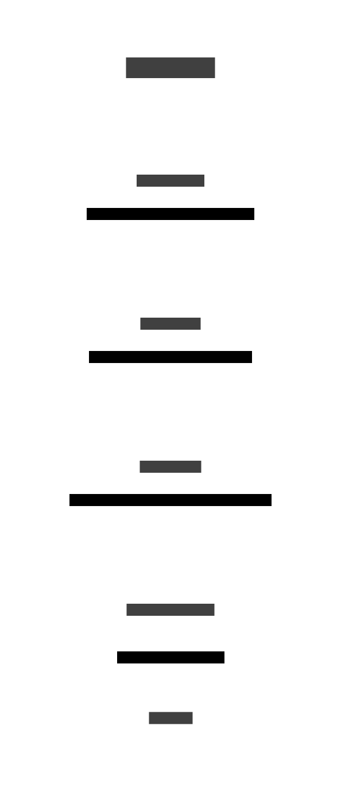

# Artifact Registry Vunerability Scanning - Saving to Bucket

Google Cloud Platform (GCP) continuously scans container images stored in Artifact Registry for vulnerabilities. More details can be found in the [Google documentation](https://cloud.google.com/artifact-registry/docs/analysis). We've based this feature on this [tutorial](https://medium.com/google-cloud/centrally-managing-artifact-registry-container-image-vulnerabilities-on-google-cloud-part-one-d86fb4791601) and involves collecting occurrences published by the Artifact Registry (e.g., discovery, package, or vulnerability), filtering for vulnerabilities, and uploading the results to a Cloud Storage bucket. Each filename includes the vulnerability ID, image name, and SHA, and are to be used for the cATO dashboard.

<figure>
  
  <figcaption>
    Diagram: Accessing outputs from Continuous Vulnerability Scanning in Artifact Registry.
  </figcaption>
</figure>

## Set up

The resources for this feature are provisioned in the [acm-core IaC GitHub repository](https://github.com/PHACDataHub/acm-core/tree/main/DMIA-PHAC/Experimentation/ph-safeinputs).

To set up without Config Contoller, gcloud commands can be found in the [gcloud-equivalent](./gcloud-equivalent/init.sh) directory. This will be removed once the IaC is solidified.

## Items To Revisit

- Review and file naming conventions and formatting when we have a better idea of how they will be used with the dashboard.
- The bucket retention policy where the vunerability outputs are being stored is currently set to 30 days, but in a addition, the vunerability scanning in Artifact Registry is only performed on artifacts younger than 30 days; after which the metadata is archived. This is something to make note as this will only be accessible for projectts actively being developed and not on pause for more than a month.

- [Cloud Functions are now part of Cloud Run](https://cloud.google.com/blog/products/serverless/google-cloud-functions-is-now-cloud-run-functions?_gl=1*5tvv8f*_ga*MzIwMDg1MDAyLjE3MTQ3Njc0NzE.*_ga_WH2QY8WWF5*MTcyOTYwOTIwOC4yNTIuMS4xNzI5NjA5NDEyLjU5LjAuMA..) and anticipate deployment scripts will need to be modified as they become more streamlined.
- The service account used to create the project namespace is hardcoded as it's in the setters.yaml file.
- Need to set up a cloudbuild trigger (in acm-core) to deploy new changes to the cloud function.
- Need some sort of testing.

## Additonal Resources

- https://cloud.google.com/run/docs/tutorials/eventarc-functions
- https://cloud.google.com/artifact-analysis/docs/investigate-vulnerabilities
- https://medium.com/@a.j.abbott24/google-cloud-surfacing-container-image-vulnerabilities-91dcf3f147f3

## Additional Considerations

- Cloud Functions uses common js, and have modified .eslintrc to accommodate.
- Containerization is currently handled by Cloud Run Functions at this time.
